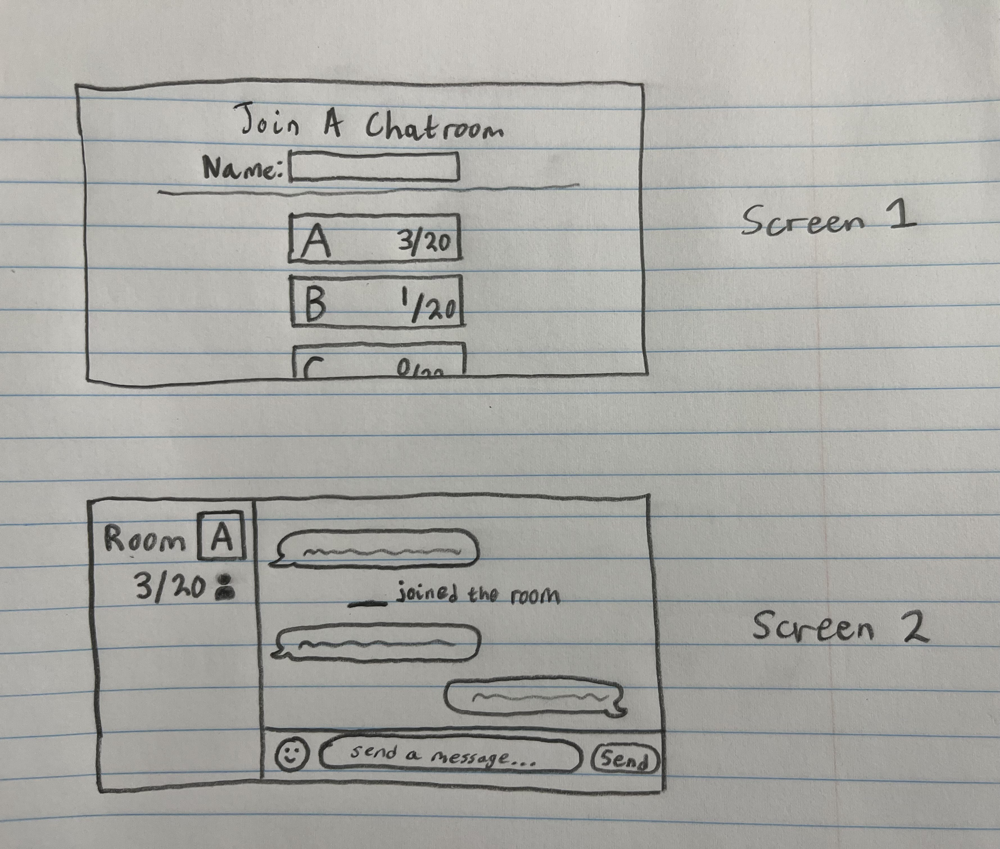

> [!NOTE]
> This repository is for a school assignment
# Startup Specification
## Elevator Pitch
Have you ever wanted to set up a quick group chat with friends (or strangers) without needing to gather everyone's profiles, send an invite code, etc.? This website will provide several chatrooms for users to quickly join and start conversing. Simply create an account, pick a name, and join the right global chatroom and you're ready.

## Key Features
- Several chatrooms
  - All chatrooms are public
  - Each chatroom can hold up to a certain amount of people
- Pick a name
- Send text or images
- Visual emoji keyboard

## Description of Technologies Used
- HTML: Basic website structure
- CSS: Styling
- JavaScript: Functionality, buttons
- Authentication: Users are required to create an account with username and password to use the chatrooms
- Database data: Users who just joined a chatroom will be able to see the last ~20 messages from before they joined, which are stored in the database
- Websocket data: Chat messages

## Design Images

## HTML Deliverable
- Three main pages:
  - Login/home page
  - Room slection page
  - Chatroom page, should be used as a template for all other chatrooms
- Links: all pages link to each other somehow (buttons, <a> tags)
- Login: username/password on homepage
- Database: Previous messages are stored in the database to be displayed to users who have just joined
- Websocket: Live chat service
- GIF button: 3rd party service call placeholder for finding GIFs

## CSS Deliverable
- CSS styling for:
  - Login/home page
  - Room selection page
  - Chatroom page
- Responsive design:
  - Header will shrink if width is too small, causing current user count to disappear
  - Chatroom page left side will disappear if width is too small
- Icon images for user counts and send button

## Javascript Deliverable
- The login page will store username data in LocalStorage
- The room selection page is now empty by default, and will only display the page content after it verifies that a username is in LocalStorage. Will redirect to login page if not present
- The room selection page will display the user's username
- The chatroom page allows the user to type messages, then press Enter or click the Send button, to 'send' a new message and display it on the DOM.
- Placeholder for websocket for receiving messages: A message will automatically be received after the user sends a message, with a short delay

## Service Deliverable
- Messages are immediately loaded in from the server when joining the room via a backend endpoint
- Sending messages uses a backend endpoint and stores them in the server's memory, to be accessed when a new user joins the room
- Left sidebar has been changed to a GIF search powered by Tenor
- GIF search calls my endpoint, which calls the 3rd-party Tenor API. It is then returned to the frontend which parses the results and displays them
  - Click on a resulting image to send it to chat

## Database Deliverable
- Connected MongoDB Atlas
  - Messages are pushed to the database and stored through existing endpoints
  - When a user joins the room, only the last 20 messages are retrieved from the database
    - Backend index.js attaches a date/time property to the message object so that it can be sorted accordingly

## Login Deliverable
- Users can now create an account and log in with credentials stored in the database
- Message history cannot be retrieved unless logged in, and will take the user to the login page if they are not logged in

## WebSocket Deliverable
- Refactor of Chatroom HTML/CSS/JS
- WebSocket is used to send and receive messages and display them
  - Backend listens for WebSocket connection
  - Frontend makes WebSocket connection with additional parameters: Room ID and username
  - Backend will send a message to all connected sockets when one disconnects, saying "{USER} has left the room"
- Message history endpoint is no longer used, updating the database is now handled by the WebSocket server
